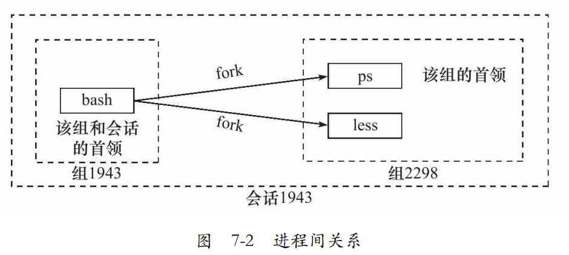

# 第七章、Linux服务器编程规范

## 7.1 Linux系统日志

工具：rsyslogd


#### syslog函数
程序通过syslog和rsyslog守护进程通信
```cpp
#include＜syslog.h＞
void syslog(int priority,const char*message,...);
```
#### openlog函数
可以改变syslog的默认输出方式
```cpp
#include＜syslog.h＞
void openlog(const char*ident,int logopt,int facility);
```

#### setlogmask函数
```cpp
#include＜syslog.h＞
int setlogmask(int maskpri);
```

#### closelog函数
```cpp
#include＜syslog.h＞
void closelog();
```

## 7.2 用户信息

一个进程拥有两个用户ID：UID和EUID
```cpp
#include＜sys/types.h＞
#include＜unistd.h＞
uid_t getuid();/*获取真实用户ID*/
uid_t geteuid();/*获取有效用户ID*/
gid_t getgid();/*获取真实组ID*/
gid_t getegid();/*获取有效组ID*/
int setuid(uid_t uid);/*设置真实用户ID*/
int seteuid(uid_t uid);/*设置有效用户ID*/
int setgid(gid_t gid);/*设置真实组ID*/
int setegid(gid_t gid);/*设置有效组ID*/
```

特权进程的意义？
如何切换用户身份？

## 7.3 进程间关系

### 进程组
Linux下每个进程都隶属于一个进程组
```cpp
//获取进程组id
#include＜unistd.h＞
pid_t getpgid(pid_t pid);
```
进程组ID和什么的PID相同？

```cpp
//该函数将PID为pid的进程的PGID设置为pgid
#include＜unistd.h＞
int setpgid(pid_t pid,pid_t pgid);
```

### 会话
一些有关联的进程组将形成一个会话（session）

```cpp
#include＜unistd.h＞
//该函数有三大效果，是什么？
pid_t setsid(void);

//该函数的返回值就是进程组id
pid_t getsid(pid_t pid);
```

### 用ps命令查看进程关系

```shell
$ps -o pid,ppid,pgid,sid,comm|less
PID PPID PGID SID COMMAND
1943 1942 1943 1943 bash
2298 1943 2298 1943 ps
2299 1943 2298 1943 less
```




## 7.4 系统资源限制

```cpp
#include＜sys/resource.h＞
int getrlimit(int resource,struct rlimit*rlim);
int setrlimit(int resource,const struct rlimit*rlim);

/////////////////
struct rlimit
{
rlim_t rlim_cur;
rlim_t rlim_max;
};
```

## 7.5 改变工作目录和根目录

```cpp
#include＜unistd.h＞
char*getcwd(char*buf,size_t size);
int chdir(const char*path);
int chroot(const char*path);
```

## 7.6 服务器程序后台化

```cpp
#include＜unistd.h＞
int daemon(int nochdir,int noclose);
```