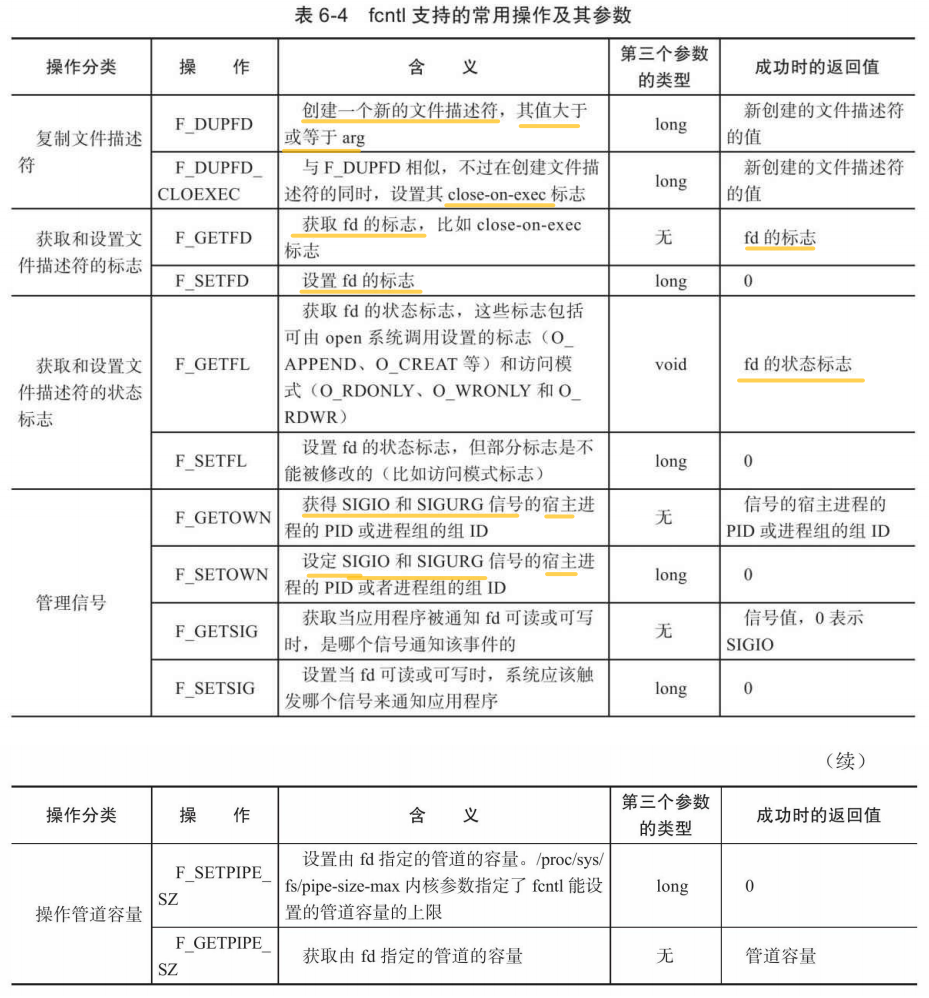

# 第六章、高级IO函数


## 6.1 pipe函数

```cpp
#include<unistd.h>
int pipe(int fd[2]);

#include<sys/types.h>
#include<sys/socket.h>
int socketpair(int domain,int type,int protocol,int fd[2]);
```


## 6.2 dup和dup2
重定向
```cpp
#include<unistd.h>
int dup(int file_descriptor);
int dup2(int file_descriptor_one,int file_descriptor_two);
```

## 6.3 readv和writev
分散读和集中写

```cpp
#include<sys/uio.h>
ssize_t readv(int fd,const struct iovec*vector,int count)；
ssize_t writev(int fd,const struct iovec*vector,int count);
```

## 6.4 sendfile函数
零拷贝（写入文件应为socket）
```cpp
#include<sys/sendfile.h>
ssize_t sendfile(int out_fd,int in_fd,off_t*offset,size_t count);
```

## 6.5 mmap函数和munmap函数

```cpp
#include<sys/mman.h>
void* mmap(void*start,size_t length,int prot,int flags,int fd,off_t offset);
int munmap(void*start,size_t length);
```

## 6.6 splice函数

零拷贝（至少有一方文件为pipe）

```cpp
#include<fcntl.h>
ssize_t splice(int fd_in,loff_t*off_in,int fd_out,loff_t*off_out,size_t len,unsigned int flags);

```

## 6.7 tee函数
零拷贝（两个管道之间）
```cpp
#include<fcntl.h>
ssize_t tee(int fd_in,int fd_out,size_t len,unsigned int flags);
```

## 6.8 fcntl函数

```cpp
#include<fcntl.h>
int fcntl(int fd,int cmd,…);
```


